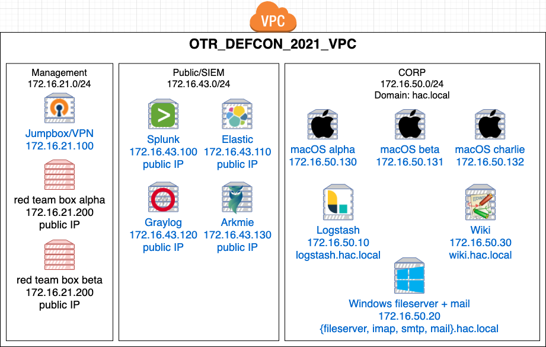

# macos-workshops

# Table of Contents  
* [Network diagram](#network-diagram)  
* [AWS resource limit increase requests](#AWS-resource-limit-increase-requests)
* [AWS pricing](#aws-pricing)

* [AWS inital setup](#AWS-inital-setup)
  * [Create an AWS account](##Create-an-AWS)
  * [Select a region](##Select-a-region)
  * [Install/Setup AWS CLI on macOS](##Install/Setup-AWS-CLI-on-macOS)
* [Install/Setup Terraform](#Install/Setup-Terraform)
* [Setup/Create management subnet](#Setup/Create-management-subnet)
  * [Setup jumpbox/VPN](##Setup-jumpbox/VPN)
* [Destroy the AWS environment](#Destroy-the-AWS-environment)
* [References](#References)

# Network diagram

  

# AWS resource limit increase requests
## Dedicated hosts
To run macOS on AWS you need to create AWS EC2 dedicated hosts of instance type `mac1.metal`. By default, you can only create `0` instances of this type. You will need to submit a request to AWS to get this increased from `0` to `3`.

## Virtual CPUs
By default AWS limits your account to 32 vCPUs but this environment requires 72 (see table below). You will need to submit a request to AWS to get this increased from `32` to `72`.

## Elastic IPs
By default you get 5 Elastic IPs per region for an account but this project needs 9 Elatic IPs. Breakdown:
  * 1 Elastic IP for the VPC NAT gateway
  * 1 Elastic IP for the VPC Internet gateway
  * 1 Elastic IP for the jumpbox
  * 2 Elastic IP for the red team boxes
  * 1 Elastic IP for the Graylog SIEM
  * 1 Elastic IP for the Splunk SIEM
  * 1 Elastic IP for the Elastic SIEM
  * 1 Elastic IP for the Arkmie/NSM box

# AWS pricing
Below is a table of all the AWS compute resources needed for this workshop. Depending your target audience size you can adjsut the size allocations for each machine. The SIEM machines and NSM/Arkmie use `r5` machines to provide as much memory as possible to keep search times minimal.

It should be noted at the time of this writing that if you plan on running this setup in AWS including the macOS machines even before they are turned on it's $25 per macOS instance. The macOS license states that each instance must be used at least 24 hours. Even, if you use macOS machines for 3 seconds you still end up paying for 24 hours worth of use.

Let's discuss the hour pricing listed in the table below. It should be noted that hourly price listed is only the EC2 computing, the pricing does not include: 
  * networking (ingress/egress) charges
  * Storage which is $0.10 per GB-month = $74.88
  * macOS up-front license cost which is $25 per instance = $75
  * Elastic IPs
  * API costs
  * Etc

| # | EC2 type | vCPU | Memory | SSD | Rate per hour | Description
| --- | --- | --- | --- | --- | --- | --- |
| 1 | r5.2xlarge | 8 | 64GB | 100GB | $0.504 | Elastic server |
| 2 | r5.2xlarge | 8 | 64GB | 100GB | $0.504 | Graylog server |
| 3 | r5.2xlarge | 8 | 64GB | 100GB | $0.504 | Splunk server |
| 4 | r5.2xlarge	 | 4 | 16GB | 100GB | $0.1856	 | NSM server |
| 5 | t2.small | 1 | 2GB | 8GB | $0.023 | Jumpbox |
| 6 | t2.small | 1 | 2GB | 20GB | $0.023 | red team box - alpha |
| 7 | t2.small | 1 | 2GB | 20GB | $0.023 | red team box - beta |
| 8 | t2.large | 2 | 8GB | 20GB | $0.0928 | Logstah ingestor server |
| 9 | t2.small | 1 | 2GB | 20GB | $0.023 | wiki server |
| 10 | t2.small | 1 | 2GB | 20GB | $0.0234 | file server |
| 11 | t2.small | 1 | 2GB | 60GB | $0.0234 | Windows server |
| 12 | mac1.metal	 | 12 | 32GB | 60GB | $1.083 | macOS client - alpha |
| 13 | mac1.metal	 | 12 | 32GB | 60GB | $1.083 | macOS client - beta |
| 14 | mac1.metal	 | 12 | 32GB | 60GB | $1.083 | macOS client - charlie |
| 15 | dedicated host | - | - | - | $1.083 | Dedicate host for macOS alpha |
| 15 | dedicated host | - | - | - | $1.083 | Dedicate host for macOS beta |
| 15 | dedicated host | - | - | - | $1.083 | Dedicate host for macOS charlie |
| Total |          | 72 | 320GB | 748GB  | $8.426/hr | |

## User table
| # | Username | Pasword | account type | Description
| --- | --- | --- | --- | --- | 
| 1 | jso-yeon@hac.local | <group_vars/corp.yml - `user_list`> | mail account | e-mail account | 
| 2 | lmanoban@hac.local | <group_vars/corp.yml - `user_list`> | mail account | e-mail account | 
| 3 | dengziqi@hac.local | <group_vars/corp.yml - `user_list`> | mail account | e-mail admin account | 
| 4 | jso-yeon | <group_vars/corp.yml - `user_list`> | SMB share | smb://172.16.50.20/public | 
| 5 | lmanoban | <group_vars/corp.yml - `user_list`> | SMB share | smb://172.16.50.20/public | 
| 6 | dengziqi | <group_vars/corp.yml - `user_list`> | SMB share | smb://172.16.50.20/private - admin | 
| 7 | jso-yeon | <group_vars/corp.yml - `user_list`> | macos Alpha VNC | vnc://172.16.50.130 | 
| 8 | lmanoban | <group_vars/corp.yml - `user_list`> | macos Beta VNC | vnc://172.16.50.131 | 
| 9 | dengziqi | <group_vars/corp.yml - `user_list`> | macos Charlie VNC | vnc://172.16.50.132 | 
| 10 | ec2-user | <group_vars/corp.yml - `vnc_admin_password`> | macos Alpha VNC | vnc://172.16.50.130 | 
| 11 | ec2-user | <group_vars/corp.yml - `vnc_admin_password`> | macos Beta VNC | vnc://172.16.50.131 | 
| 12 | ec2-user | <group_vars/corp.yml - `vnc_admin_password`> | macos Charlie VNC | vnc://172.16.50.132 | 

## Generate SSH keys for red team exercise
1. `cd macos-workshop`
1. `ssh-keygen -t rsa -b 2048 -C "lmanoban@hac.local" -f files/comp_ssh_keys/id_rsa -q -N ""`

## Instructions to setup AWS environment
1. [AWS + Terraform](docs/terraform.md)
1. [Setup management subnet](docs/setup_mamangement_subnet.md)
1. [Init Ansible playbooks](docs/init_ansible_playbooks.md)
1. [Setup corp subnet](docs/setup_corp_subnet.md)
1. [Setup macOS clients](docs/setup_macos_clients.md)

# Install/Setup public subnet
The playbook instructions for these instances assume they are publicaly facing and that these instances have public DNS A records that can be used by Let's Encrypt to generate an HTTPS certificate for NGINX.

## Install/Setup Elastic, Graylog, Splunk,Arkmie
* [Arkmie/Moloch](docs/setup_arkimie.md)
* [Elastic](docs/setup_elastic.md)
* [Graylog](docs/setup_graylog.md)
* [Splunk](docs/setup_splunk.md)
* [Logstash ingestor](docs/setup_logstash_ingestor.md)

# Install/Setup corp subnet
The playbook instructions for these instances are to setup

# Destroy the AWS environment
1. `cd macos-workshop/terraform`
1. `terraform destroy`
  1. 

## JSON logs
* 
* 
* 
* 

# References
## Ansible
* [docker_stack – docker stack module](https://docs.ansible.com/ansible/2.8/modules/docker_stack_module.html)
* [ansible.windows.win_user – Manages local Windows user accounts](https://docs.ansible.com/ansible/latest/collections/ansible/windows/win_user_module.html)
* [TALES OF A RED TEAMER: DEPLOYING SHENANIGANS TO WINDOWS WITH ANSIBLE](https://holdmybeersecurity.com/2019/02/26/tales-of-a-red-teamer-deploying-shenanigans-to-windows-with-ansible/)
* [CptOfEvilMinions/RedTeaming-Public - windows.yml](https://github.com/CptOfEvilMinions/RedTeaming-Public/blob/master/WindowsDeployment/group_vars/windows-same-pass.yml)
* [ansible.windows.win_file – Creates, touches or removes files or directories](https://docs.ansible.com/ansible/latest/collections/ansible/windows/win_file_module.html)
* [ansible.windows.win_share – Manage Windows shares](https://docs.ansible.com/ansible/latest/collections/ansible/windows/win_share_module.html)
* [Ansible - how to remove an item from a list?](https://stackoverflow.com/questions/40927792/ansible-how-to-remove-an-item-from-a-list)
* [community.crypto.openssl_privatekey – Generate OpenSSL private keys](https://docs.ansible.com/ansible/latest/collections/community/crypto/openssl_privatekey_module.html)
* [Generate OpenSSL Self-Signed Certificates with Ansible](https://computingforgeeks.com/generate-openssl-self-signed-certificates-with-ansible/)
* [Ansible Debug: Print Variable & List All Variables – Playbook](https://www.shellhacks.com/ansible-debug-print-variable-list-all-variables-playbook/)
* [Checking if a File Exists in Ansible](https://phoenixnap.com/kb/ansible-check-if-file-exists)
* [Configure Network Cards by PCI Address with Ansible Facts](https://www.ansible.com/blog/configure-network-cards-by-pci-address-with-ansible-facts)
* [ansible.builtin.expect – Executes a command and responds to prompts](https://docs.ansible.com/ansible/latest/collections/ansible/builtin/expect_module.html)
* [How to assign an empty value to a variable in Ansible?](https://serverfault.com/questions/805576/how-to-assign-an-empty-value-to-a-variable-in-ansible)
* [How to inspect a json response from Ansible URI call](https://stackoverflow.com/questions/40235550/how-to-inspect-a-json-response-from-ansible-uri-call)
* [ansible.builtin.expect – Executes a command and responds to prompts](https://docs.ansible.com/ansible/latest/collections/ansible/builtin/expect_module.html)
* [ansible.builtin.lineinfile – Manage lines in text files](https://docs.ansible.com/ansible/latest/collections/ansible/builtin/lineinfile_module.html)
* [ansible.builtin.uri – Interacts with webservices](https://docs.ansible.com/ansible/latest/collections/ansible/builtin/uri_module.html)
* [Update: Using Free Let’s Encrypt SSL/TLS Certificates with NGINX](https://www.nginx.com/blog/using-free-ssltls-certificates-from-lets-encrypt-with-nginx/)
* [How To Acquire a Let's Encrypt Certificate Using Ansible on Ubuntu 18.04](https://www.digitalocean.com/community/tutorials/how-to-acquire-a-let-s-encrypt-certificate-using-ansible-on-ubuntu-18-04)
* [community.crypto.openssl_csr – Generate OpenSSL Certificate Signing Request (CSR)](https://docs.ansible.com/ansible/latest/collections/community/crypto/openssl_csr_module.html)
* [community.crypto.openssl_privatekey – Generate OpenSSL private keys](https://docs.ansible.com/ansible/latest/collections/community/crypto/openssl_privatekey_module.html)
* [community.crypto.acme_certificate – Create SSL/TLS certificates with the ACME protocol](https://docs.ansible.com/ansible/latest/collections/community/crypto/acme_certificate_module.html)
* [ansible.builtin.slurp – Slurps a file from remote nodes](https://docs.ansible.com/ansible/latest/collections/ansible/builtin/slurp_module.html)
* [community.docker.docker_config – Manage docker configs.](https://docs.ansible.com/ansible/latest/collections/community/docker/docker_config_module.html#ansible-collections-community-docker-docker-config-module)
* [Install Chocolatey With Ansible On Windows Hosts](http://www.ntweekly.com/2020/09/09/install-chocolatey-with-ansible-on-windows-hosts/)
* [chocolatey.chocolatey.win_chocolatey – Manage packages using chocolatey](https://docs.ansible.com/ansible/latest/collections/chocolatey/chocolatey/win_chocolatey_module.html)
* [Ansible - Only do something if another action changed](https://raymii.org/s/tutorials/Ansible_-_Only-do-something-if-another-action-changed.html)
* [community.general.launchd – Manage macOS services](https://docs.ansible.com/ansible/latest/collections/community/general/launchd_module.html)
* [ansible.posix.authorized_key – Adds or removes an SSH authorized key](https://docs.ansible.com/ansible/latest/collections/ansible/posix/authorized_key_module.html)
* [How to make Ansible run one certain task only on one host?](https://stackoverflow.com/questions/47342724/how-to-make-ansible-run-one-certain-task-only-on-one-host)
* [ansible-playbooks/roles/new-user/tasks/create-user.yml](https://github.com/ideasonpurpose/ansible-playbooks/blob/master/roles/new-user/tasks/create-user.yml)
* [ansible.builtin.fileglob – list files matching a pattern](https://docs.ansible.com/ansible/latest/collections/ansible/builtin/fileglob_lookup.html)
* 
* 
* 
* 

## Docker 
* [How To Install and Use Docker on Ubuntu 20.04](https://www.digitalocean.com/community/tutorials/how-to-install-and-use-docker-on-ubuntu-20-04)
* [CptOfEvilMinions/GuardiansOfTheNetwork - Install Docker with Ansible](https://raw.githubusercontent.com/CptOfEvilMinions/GuardiansOfTheNetwork/master/Setup/roles/docker/setup_docker.yml)
* [DockerHub - NGINX](https://hub.docker.com/_/nginx)
* [CptOfEvilMinions/ChooseYourSIEMAdventure - docker-compose-swarm-elastic.yml](https://github.com/CptOfEvilMinions/ChooseYourSIEMAdventure/blob/main/docker-compose-swarm-elastic.yml)
* [DockerHub - Atlassian Confluence](https://hub.docker.com/r/atlassian/confluence-server/)
* [Docker-compose file for the official Atlassian Confluence Server](https://gist.github.com/sebastian13/808c6363933943ad892f433db9d6dba7)
* [Setting hostname with Ansible](https://www.derpturkey.com/setting-host-with-ansible-in-ubuntu/)
* 
* 
* 
* 
* 