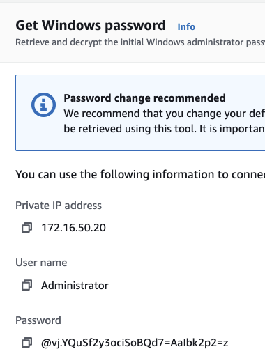
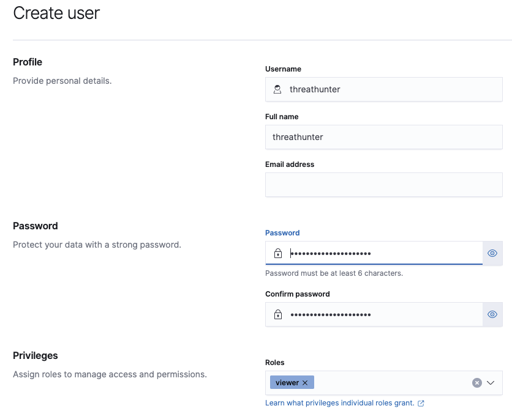

# macos-workshops

# Table of Contents  
* [Network diagram](#network-diagram)  
* [AWS resource limit increase requests](#AWS-resource-limit-increase-requests)
* [AWS pricing](#aws-pricing)
* [AWS inital setup](#AWS-inital-setup)
  * [Create an AWS account](##Create-an-AWS)
  * [Select a region](##Select-a-region)
  * [Install/Setup AWS CLI on macOS](##Install/Setup-AWS-CLI-on-macOS)
* [Install/Setup Terraform](#Install/Setup-Terraform)
* [Setup/Create management subnet](#Setup/Create-management-subnet)
  * [Setup jumpbox/VPN](##Setup-jumpbox/VPN)
* [Destroy the AWS environment](#Destroy-the-AWS-environment)
* [References](#References)

# Network diagram

  

# AWS resource limit increase requests
## Dedicated hosts
To run macOS on AWS you need to create AWS EC2 dedicated hosts of instance type `mac1.metal`. By default, you can only create `0` instances of this type. You will need to submit a request to AWS to get this increased from `0` to `3`.

## Virtual CPUs
By default AWS limits your account to 32 vCPUs but this environment requires 72 (see table below). You will need to submit a request to AWS to get this increased from `32` to `72`.

## Elastic IPs
By default you get 5 Elastic IPs per region for an account but this project needs 9 Elatic IPs. Breakdown:
  * 1 Elastic IP for the VPC NAT gateway
  * 1 Elastic IP for the VPC Internet gateway
  * 1 Elastic IP for the jumpbox
  * 2 Elastic IP for the red team boxes
  * 1 Elastic IP for the Graylog SIEM
  * 1 Elastic IP for the Splunk SIEM
  * 1 Elastic IP for the Elastic SIEM
  * 1 Elastic IP for the Arkmie/NSM box

# AWS pricing
Below is a table of all the AWS compute resources needed for this workshop. Depending your target audience size you can adjsut the size allocations for each machine. The SIEM machines and NSM/Arkmie use `r5` machines to provide as much memory as possible to keep search times minimal.

It should be noted at the time of this writing that if you plan on running this setup in AWS including the macOS machines even before they are turned on it's $25 per macOS instance. The macOS license states that each instance must be used at least 24 hours. Even, if you use macOS machines for 3 seconds you still end up paying for 24 hours worth of use.

Let's discuss the hour pricing listed in the table below. It should be noted that hourly price listed is only the EC2 computing, the pricing does not include: 
  * networking (ingress/egress) charges
  * Storage which is $0.10 per GB-month = $74.88
  * macOS up-front license cost which is $25 per instance = $75
  * Elastic IPs
  * API costs
  * Etc

| # | EC2 type | vCPU | Memory | SSD | Rate per hour | Description
| --- | --- | --- | --- | --- | --- | --- |
| 1 | r5.2xlarge | 8 | 64GB | 100GB | $0.504 | Elastic server |
| 2 | r5.2xlarge | 8 | 64GB | 100GB | $0.504 | Graylog server |
| 3 | r5.2xlarge | 8 | 64GB | 100GB | $0.504 | Splunk server |
| 4 | r5.2xlarge	 | 4 | 16GB | 100GB | $0.1856	 | NSM server |
| 5 | t2.small | 1 | 2GB | 8GB | $0.023 | Jumpbox |
| 6 | t2.small | 1 | 2GB | 20GB | $0.023 | red team box - alpha |
| 7 | t2.small | 1 | 2GB | 20GB | $0.023 | red team box - beta |
| 8 | t2.large | 2 | 8GB | 20GB | $0.0928 | Logstah ingestor server |
| 9 | t2.small | 1 | 2GB | 20GB | $0.023 | wiki server |
| 10 | t2.small | 1 | 2GB | 20GB | $0.0234 | file server |
| 11 | t2.small | 1 | 2GB | 60GB | $0.0234 | Windows server |
| 12 | mac1.metal	 | 12 | 32GB | 60GB | $1.083 | macOS client - alpha |
| 13 | mac1.metal	 | 12 | 32GB | 60GB | $1.083 | macOS client - beta |
| 14 | mac1.metal	 | 12 | 32GB | 60GB | $1.083 | macOS client - charlie |
| 15 | dedicated host | - | - | - | $1.083 | Dedicate host for macOS alpha |
| 15 | dedicated host | - | - | - | $1.083 | Dedicate host for macOS beta |
| 15 | dedicated host | - | - | - | $1.083 | Dedicate host for macOS charlie |
| Total |          | 72 | 320GB | 748GB  | $8.426/hr | |

# AWS inital setup
## Create an AWS account
Follow the steps on this [page to create an AWS account](https://aws.amazon.com/premiumsupport/knowledge-center/create-and-activate-aws-account/)

## Select a region anda avability zone
Once you login into AWS it should automatically select the nearest datacenter based on your IP address. This repo has been created and tested on the `US East - Ohio` datacenter and avablility zone `B`. This repo should be compatible with any region and avability zone but pick the best region based on your location/users. As a side note, dedicated hosts to run macOS only exist in certain regions and avability zones which is why we selected `Ohio` for the region and `B` for the avability zone.

# Install/Setup AWS CLI and Terraform on macOS
* [AWS CLI Windows install](https://docs.aws.amazon.com/cli/latest/userguide/install-cliv2-windows.html)
* [AWS CLI Linux install](https://docs.aws.amazon.com/cli/latest/userguide/install-cliv2-linux.html)
* [AWS CLI macOS install](https://docs.aws.amazon.com/cli/latest/userguide/install-cliv2-mac.html)

## Generate AWS access keys
1. Select `<YOUR username>` in the top-right then "My Security Credentials"
1. Scroll down to "Access keys for CLI..."
1. Select "Create access key"
  1. Save your generated access key ID and secret access key in a safe location

## Install/Setup AWS CLI with AWS access keys
1. Open terminal
1. `curl "https://awscli.amazonaws.com/AWSCLIV2.pkg" -o /tmp/AWSCLIV2.pkg`
  1. Download AWS CLI v2
1. `sudo installer -pkg /tmp/AWSCLIV2.pkg -target /`
  1. Install AWS CLI v2
1. `aws configure`
  1. Paste the access key ID generated from above
  1. Paste the access key generated from above
  1. Enter your region - Ohio is `us-east-2`
  1. Leave ouput format as default
  1. 
1. Credentails are saved at `~/.aws/credentials`

## Install/Setup Terraform
### Install Terraform on macOS
It should be noted that this repo only supports Terraform v0.15 and greater.

* [Terraform install on Windows](https://learn.hashicorp.com/tutorials/terraform/install-cli)
* [Terraform install on Linux ](https://learn.hashicorp.com/tutorials/terraform/install-cli)
* [Terraform install on macOS](https://learn.hashicorp.com/tutorials/terraform/install-cli)

1. `brew tap hashicorp/tap`
1. `brew install hashicorp/tap/terraform`

# Spin up Terraform environment
## Generate SSH key pair
You might be curious why you need to generate SSH keys rather than using a pre-existing key pair. The reason I create a SSH key is because when you create a Winodws machine on AWS the only way to get the password is provide your SSH PRIVATE KEY. Personally, I am not a huge fan of providing this to AWS so I prefer to generate a key pair that I can burn after the worskhop. Additionally, you can share this SSH key pair with your team for the duration of the workshop.

1. `git clone https://github.com/OTRF/macos-workshops`
1. `cd macos-workshops/terraform`
1. `ssh-keygen -b 4096 -t rsa -m pem -f ssh_keys/id_rsa -q -N ""`

## Setup variables.tf
1. `vim variables.tf` and set:
  1. `VPC_NAME` - Set this to a generic name like `OTR_DEFCON_2021`. It's important to note that all resouces created will be prepended with this variable. For example, the EC2 name for the Elastic box will be `OTR_DEFCON_2021_jump_box`.
  1. `vpcCIDRblock` - This defines the network subnet for the VPC. The subnet should be a Class B because Class C subnets will be created inside the VPC. - Default is `172.16.0.0/16`
    1. `managementCIDRblock` - This subnet hosts the VPN/jumpbox and the red team boxes. Set this value to a class C subnet inside the subnet defined above - default `172.16.21.0/24`.
    1. `publicCIDRblock` - This subnet hosts the boxes that will be interacted by workshop participants so the SIEM boxes - default `172.16.43.0/16`
    1. `corpCIDRblock` - This subnet hosts the boxes that will emulate an enterprise environment - default `172.16.50.0/16`
  1. `availabilityZone` - The AWS region to create resources in. Be default this is set to Ohio: `us-east-2b`. 
  1. `ubunut-ami` - Set this to the AMI UID 
    1. AWS Services > Compute > EC2 > Images > AMIs
    1. Search for `Ubuntu 20.04`
    1. Copy the AMI ID
  1. Repeat the same steps for the Ubuntu AMI for the Windows server AMI
  1. `siem_servers_map` - This maps SIEM names to IP addresses for the local subnet. It's best to leave this set as default.
  1. `management_subnet_map` - Same as the map above
  1. `corp_servers_map` - Same as the maps above

## Spin up Terraform environment
1. `terraform init`
1. `terraform plan`
1. `terraform apply`

# Install/Setup Management subnet
## Check termination protection on jumpbox
1. Services > Compute > EC2 > Instances > Instances
1. Check `${VPC_NAME}_jump_box` 
1. Actions > Instance settings > Change termination protection
  1. Ensure that termination protection is enabled

## Setup jumpbox/VPN
The Terraform playbook above will execute the following script `files/setup_openvpn.sh` to setup an OpenVPN server on the jumpbox.

1. `cat ~/.ssh/id_rsa.pub` and copy output
1. `ssh -i ssh_keys/id_rsa ubuntu@<jumpbox public IPv4>`
1. `echo '<YOUR SSH pub key>' >> ~/.ssh/authorized_keys`
1. `sudo su`
1. `apt update -y && apt upgrade -y && reboot`
1. Login into jumpbox using `YOUR` SSH key
1. Ensure that `client.ovpn` exists in the home directory
1. `sudo su`
1. Add VPC subnets to OpenVPN server config
  1. `echo 'push "route 172.16.21.0 255.255.255.0"' >> /etc/openvpn/server.conf`
    1. Management subnet
  1. `echo 'push "route 172.16.43.0 255.255.255.0"' >> /etc/openvpn/server.conf`
    1. Public subnet
  1. `echo 'push "route 172.16.50.0 255.255.255.0"' >> /etc/openvpn/server.conf`
    1. Corp subnet
  1. `echo 'pull-filter ignore redirect-gateway' >> client.ovpn`
    1. Tell client to ignore sending all traffic to OpenVPN server
1. `systemctl restart openvpn@server.service`
1. `exit`
1. `scp ubuntu@<jumpbox public IPv4>:/home/ubuntu/client.ovpn ~/Desktop/client.ovpn`
  1. Download OpenVPN client config
1. Import the OpenVPN client config into your VPN client

# Setup public DNS records
For this workshop we acquired several doamins but the domain to be used by workshop participants is `huntapples.com`. This public domain will be used to generate Let's Encrypt HTTP certificates for Splunk, Elastic, Graylog, and Arkmie.
<TODO>
<TODO>
<TODO>

# Init Ansible playbooks
## hosts.ini
This file specify the IP address for each playbook. If you used the provided IP addresses in the Terraform playbook there is no action items. If you modified the IP addresses please open this file and set the correct IP addresses.

## group_vars/all.yml
<TODO>

## group_vars/corp.yml
1. `vim group_vars/corp.yml` and set:
  1. `win_file_server_password` - Password for normal users for file server
  1. `win_file_server_admin_password` - Password for admin users for file server

## group_vars/sec_tools.yml
<TODO>

## group_vars/windows.yml
<TODO>

# Install/Setup corp subnet
## Wiki server
1. `cd macos-workshop`
1. `ansible-playbook -i hosts.ini deploy_wiki_server.yml -u ubuntu --key-file terraform/ssh_keys/id_rsa`
1. Open web browser to `http://172.16.50.30:80`

## Windows file server
### Get Administrator password
1. Login into AWS webGUI console
1. Services > Compute > EC2 
1. Select the Windows file server EC2 instance
1. Actions > Security > Get Windows Password
1. Paste the contents of `terraform/ssh_keys/id_rsa` into the text box
  1. 
1. Select "Decrypt Password"
  1. 

### Setup WinRM
1. Use an RDP client to connect to Windows file server
1. Open a Powershell instance as Administrator
1. `Set-ExecutionPolicy Unrestricted`
1. `powershell -NoProfile -ExecutionPolicy Bypass -Command "iex ((new-object net.webclient).DownloadString('https://raw.githubusercontent.com/ansible/ansible/devel/examples/scripts/ConfigureRemotingForAnsible.ps1'))"`
1. `exit`

### Setup group_vars/windows.yml
1. `vim group_vars/windows.yml` and set:
  1. `ansible_user` - `Administrator`
  1. `ansible_password` - Set this to the password obtained from the AWS console with SSH key

### Run Ansible playbook
1. `cd macos-workshop`
1. `ansible-playbook -i hosts.ini deploy_win_file_server.yml`

## Logstash ingestor
1. `cd macos-workshop`
1. `ansible-playbook -i hosts.ini deploy_logstash_ingestor.yml -u ubuntu --key-file terraform/ssh_keys/id_rsa`

## Setup VPC mirror sessions
<TODO>

# Install/Setup public subnet
The playbook instructions for these instances assume they are publicaly facing and that these instances have public DNS A records that can be used by Let's Encrypt to generate an HTTPS certificate for NGINX.

## Arkmie
1. `cd macos-workshop`
1. `ansible-playbook -i hosts.ini deploy_arkmie.yml -u ubuntu --key-file terraform/ssh_keys/id_rsa`

## Generate OpenSSL private key and public cert
1. `cd macos-workshop`
1. `git clone https://github.com/CptOfEvilMinions/ChooseYourSIEMAdventure`
1. `cd ChooseYourSIEMAdventure`
1. `vim ChooseYourSIEMAdventure/conf/tls/tls.conf`

<TODO>

## Elastic
For the lastest installation instructions for this repo please see this blog post: [IR TALES: THE QUEST FOR THE HOLY SIEM: ELASTIC STACK + SYSMON + OSQUERY](https://holdmybeersecurity.com/2021/01/27/ir-tales-the-quest-for-the-holy-siem-elastic-stack-sysmon-osquery/)

1. `vim hosts.ini` and set
1. `vim group_vars/all.yml` and set:
  1. `base_domain` - <TODO>
<TODO>

### Create workshop user
1. Open browser to `https://<Elastic IP for Elastic>` and login
  1. Enter `elastic` for username
  1. Enter `<ealstic user password generated during Ansible playbook - cat /tmp/elasticsearch-setup-passwords.txt>`
1. Settings > Management > Stack Management
1. Security > Users
1. Select "Create user" in the top-right
  1. Enter `threathunter` into username
  1. Enter `threathunter` into full name
  1. Leave e-mail blank
  1. Enter a password for the user
  1. Select `viewer` for roles
  1. 
  1. Select "Create user"

## Graylog
<TODO>

## Splunk
<TODO>

## Test SIEMs and logstash ingestor

# Destroy the AWS environment
1. `cd macos-workshop/terraform`
1. `terraform destroy`
  1. 

# References
## AWS
* [How do I create and activate a new AWS account?](https://aws.amazon.com/premiumsupport/knowledge-center/create-and-activate-aws-account/)
* [Elastic IP addresses](https://docs.aws.amazon.com/vpc/latest/userguide/vpc-eips.html)
* [AWS CLI Windows install](https://docs.aws.amazon.com/cli/latest/userguide/install-cliv2-windows.html)
* [AWS CLI Linux install](https://docs.aws.amazon.com/cli/latest/userguide/install-cliv2-linux.html)
* [AWS CLI macOS install](https://docs.aws.amazon.com/cli/latest/userguide/install-cliv2-mac.html)
* [Quick configuration with aws configure](https://docs.aws.amazon.com/cli/latest/userguide/cli-configure-quickstart.html)
* 
* 
* 
* 
* 
* 

## Arkmie
* [Redirect HTTP to HTTPS in Nginx](https://serversforhackers.com/c/redirect-http-to-https-nginx)
* [Arkmie - How do I proxy Arkime using Apache](https://arkime.com/faq)
* [How To Create a Self-Signed SSL Certificate for Nginx in Ubuntu 16.04](https://www.digitalocean.com/community/tutorials/how-to-create-a-self-signed-ssl-certificate-for-nginx-in-ubuntu-16-04)
* [Arkmie install instructions](https://raw.githubusercontent.com/arkime/arkime/main/release/README.txt)
* [How To Install Java with Apt on Ubuntu 20.04](https://www.digitalocean.com/community/tutorials/how-to-install-java-with-apt-on-ubuntu-20-04)
* [community.docker.docker_swarm – Manage Swarm cluster](https://docs.ansible.com/ansible/latest/collections/community/docker/docker_swarm_module.html)
* [How to Use the Netplan Network Configuration Tool on Linux](https://www.linux.com/topic/distributions/how-use-netplan-network-configuration-tool-linux/)
* [Elasticsearch](https://docs.graylog.org/en/4.0/pages/installation/os/ubuntu.html)
* [Elasticsearch - Response Data Formats](https://www.elastic.co/guide/en/elasticsearch/reference/current/sql-rest-format.html)
* [cat indices API](https://www.elastic.co/guide/en/elasticsearch/reference/current/cat-indices.html)
* [Elasticsearch - Delete API](https://www.elastic.co/guide/en/elasticsearch/reference/current/docs-delete.html)
* 
* 
* 
* 
* 

## Terraform
* [Install Terraform](https://learn.hashicorp.com/tutorials/terraform/install-cli)
* [Resource: aws_eip](https://registry.terraform.io/providers/hashicorp/aws/latest/docs/resources/eip)
* [Resource: aws_nat_gateway](https://registry.terraform.io/providers/hashicorp/aws/latest/docs/resources/nat_gateway)
* [How to use Terraform variables](https://upcloud.com/community/tutorials/terraform-variables/)
* [Github - angristan/openvpn-install](https://github.com/angristan/openvpn-install)
* [aws_eip_association](https://registry.terraform.io/providers/hashicorp/aws/latest/docs/resources/eip_association)
* [aws_ec2_traffic_mirror_filter_rule](https://registry.terraform.io/providers/hashicorp/aws/latest/docs/resources/ec2_traffic_mirror_filter_rule)
* [aws_network_interface](https://registry.terraform.io/providers/hashicorp/aws/latest/docs/resources/network_interface)
* 
* 
* 

## Ansible
* [docker_stack – docker stack module](https://docs.ansible.com/ansible/2.8/modules/docker_stack_module.html)
* [ansible.windows.win_user – Manages local Windows user accounts](https://docs.ansible.com/ansible/latest/collections/ansible/windows/win_user_module.html)
* [TALES OF A RED TEAMER: DEPLOYING SHENANIGANS TO WINDOWS WITH ANSIBLE](https://holdmybeersecurity.com/2019/02/26/tales-of-a-red-teamer-deploying-shenanigans-to-windows-with-ansible/)
* [CptOfEvilMinions/RedTeaming-Public - windows.yml](https://github.com/CptOfEvilMinions/RedTeaming-Public/blob/master/WindowsDeployment/group_vars/windows-same-pass.yml)
* [ansible.windows.win_file – Creates, touches or removes files or directories](https://docs.ansible.com/ansible/latest/collections/ansible/windows/win_file_module.html)
* [ansible.windows.win_share – Manage Windows shares](https://docs.ansible.com/ansible/latest/collections/ansible/windows/win_share_module.html)
* [Ansible - how to remove an item from a list?](https://stackoverflow.com/questions/40927792/ansible-how-to-remove-an-item-from-a-list)
* [community.crypto.openssl_privatekey – Generate OpenSSL private keys](https://docs.ansible.com/ansible/latest/collections/community/crypto/openssl_privatekey_module.html)
* [Generate OpenSSL Self-Signed Certificates with Ansible](https://computingforgeeks.com/generate-openssl-self-signed-certificates-with-ansible/)
* [Ansible Debug: Print Variable & List All Variables – Playbook](https://www.shellhacks.com/ansible-debug-print-variable-list-all-variables-playbook/)
* [Checking if a File Exists in Ansible](https://phoenixnap.com/kb/ansible-check-if-file-exists)
* [Configure Network Cards by PCI Address with Ansible Facts](https://www.ansible.com/blog/configure-network-cards-by-pci-address-with-ansible-facts)
* [ansible.builtin.expect – Executes a command and responds to prompts](https://docs.ansible.com/ansible/latest/collections/ansible/builtin/expect_module.html)
* [How to assign an empty value to a variable in Ansible?](https://serverfault.com/questions/805576/how-to-assign-an-empty-value-to-a-variable-in-ansible)
* [How to inspect a json response from Ansible URI call](https://stackoverflow.com/questions/40235550/how-to-inspect-a-json-response-from-ansible-uri-call)
* [ansible.builtin.expect – Executes a command and responds to prompts](https://docs.ansible.com/ansible/latest/collections/ansible/builtin/expect_module.html)
* [ansible.builtin.lineinfile – Manage lines in text files](https://docs.ansible.com/ansible/latest/collections/ansible/builtin/lineinfile_module.html)
* [ansible.builtin.uri – Interacts with webservices](https://docs.ansible.com/ansible/latest/collections/ansible/builtin/uri_module.html)
* [Update: Using Free Let’s Encrypt SSL/TLS Certificates with NGINX](https://www.nginx.com/blog/using-free-ssltls-certificates-from-lets-encrypt-with-nginx/)
* [How To Acquire a Let's Encrypt Certificate Using Ansible on Ubuntu 18.04](https://www.digitalocean.com/community/tutorials/how-to-acquire-a-let-s-encrypt-certificate-using-ansible-on-ubuntu-18-04)
* [community.crypto.openssl_csr – Generate OpenSSL Certificate Signing Request (CSR)](https://docs.ansible.com/ansible/latest/collections/community/crypto/openssl_csr_module.html)
* [community.crypto.openssl_privatekey – Generate OpenSSL private keys](https://docs.ansible.com/ansible/latest/collections/community/crypto/openssl_privatekey_module.html)
* [community.crypto.acme_certificate – Create SSL/TLS certificates with the ACME protocol](https://docs.ansible.com/ansible/latest/collections/community/crypto/acme_certificate_module.html)
* 
* 
* 
* 
* 
* 
* 

## OpenVPN
* [Expanding the scope of the VPN to include additional machines on either the client or server subnet.](https://openvpn.net/community-resources/expanding-the-scope-of-the-vpn-to-include-additional-machines-on-either-the-client-or-server-subnet/)
* [How to Download a File from a Server with SSH / SCP](https://osxdaily.com/2016/11/07/download-file-from-server-scp-ssh/)
* 
* 
* 
* 
* 
* 

## Docker 
* [How To Install and Use Docker on Ubuntu 20.04](https://www.digitalocean.com/community/tutorials/how-to-install-and-use-docker-on-ubuntu-20-04)
* [CptOfEvilMinions/GuardiansOfTheNetwork - Install Docker with Ansible](https://raw.githubusercontent.com/CptOfEvilMinions/GuardiansOfTheNetwork/master/Setup/roles/docker/setup_docker.yml)
* [DockerHub - NGINX](https://hub.docker.com/_/nginx)
* [CptOfEvilMinions/ChooseYourSIEMAdventure - docker-compose-swarm-elastic.yml](https://github.com/CptOfEvilMinions/ChooseYourSIEMAdventure/blob/main/docker-compose-swarm-elastic.yml)
* [DockerHub - Atlassian Confluence](https://hub.docker.com/r/atlassian/confluence-server/)
* [Docker-compose file for the official Atlassian Confluence Server](https://gist.github.com/sebastian13/808c6363933943ad892f433db9d6dba7)
* 
* 
* 
* 
* 
* 

## Wiki
* [Bitnami - Dokuwiki](https://raw.githubusercontent.com/bitnami/bitnami-docker-dokuwiki/master/docker-compose.yml)
* [Bitnami Docker Image for DokuWiki](https://hub.docker.com/r/bitnami/dokuwiki/)
* 
* 
* 
* 