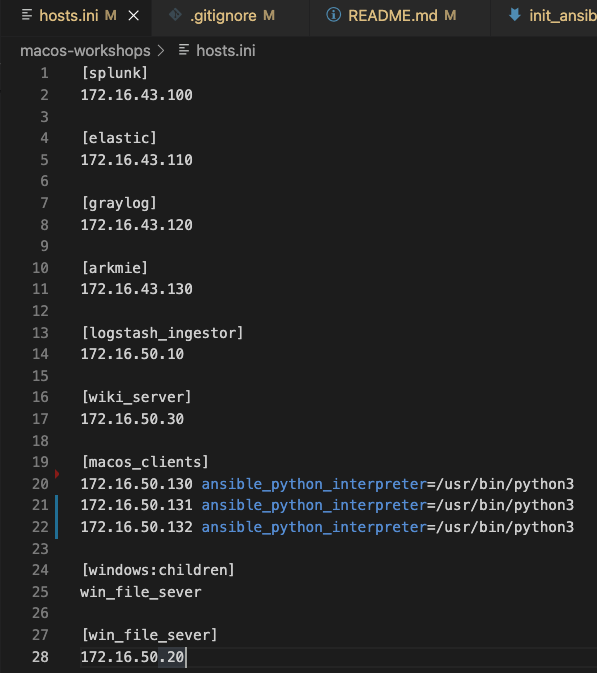
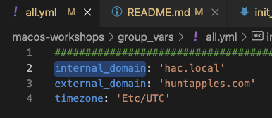
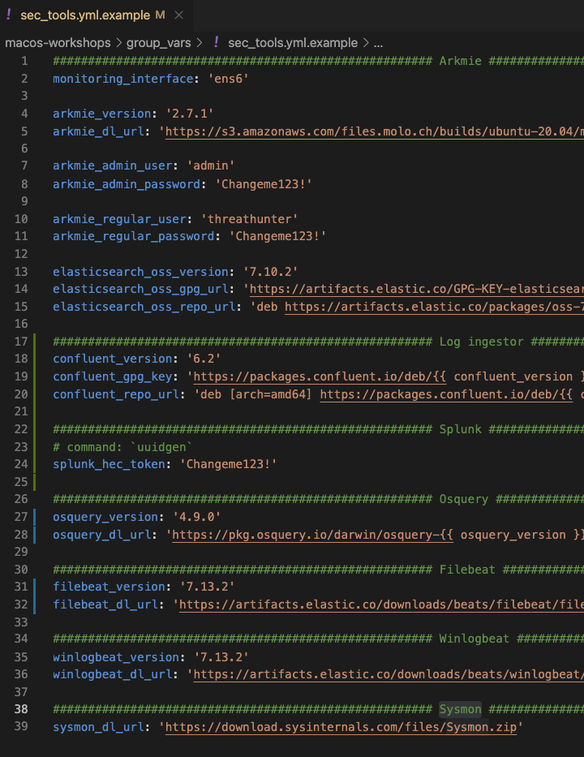
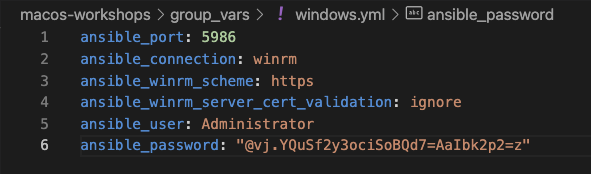

# Init Ansible playbooks

# Init Ansible playbooks
## hosts.ini
This file specify the IP address for each playbook. If you used the provided IP addresses in the Terraform playbook there is no action items. If you modified the IP addresses please open this file and set the correct IP addresses.

## group_vars/all.yml
1. `cp group_vars/all.yml.example group_vars/all.yml`
1. `vim group_vars/all.yml` and set:
  1. `internal_domain` - The domain for the CORP subnet resources
  1. `external_domain` - The domain for external accessible resources
  1. 

## group_vars/corp.yml
1. `cp group_vars/corp.yml.example group_vars/corp.yml`
1. `vim group_vars/corp.yml` and set:
  1. Users
    1. `user_list` - Set password for each user. This password will be used for Windows share users, e-mail, and macOS VNC.
  1. Mail server
    1. `db_hMailServer_password` - Set the password for the hMailServer database password
  1. macOS
    1. `vnc_admin_password` - VNC password for the `ec2-user` (default AWS user) admin account
  1. Logstash
    1. `elastic_version` - Logstash version to use the Logstash ingestor
  1. 

## group_vars/sec_tools.yml
1. `cp group_vars/sec_tools.yml.example group_vars/sec_tools.yml`
1. `uuid` - Copy output
1. `vim group_vars/sec_tools.yml` and set:
  1. Arkmie
    1. `monitoring_interface` - Interface for Arkmie to monitor
    1. `arkmie_version` - Version of Armkie to download and install
    1. `arkmie_admin_user` - Set the Arkmie admin username
    1. `arkmie_admin_password` - Set the Arkmie admin password
    1. `arkmie_regular_user` - Set the Arkmie workshop user username
    1. `arkmie_regular_password` - Set the Arkmie workshop user password
    1. `elasticsearch_oss_version` - Specify the version of Elasticsearch to install
  1. Log ingestor
    1. `confluent_version` - Version of Confluent suite/Kafka to install
  1. Splunk
    1. `splunk_hec_token` - Set this to the output of `uuid` from above
  1. Osquery
    1. `osquery_version` - Version of Osquery to install on endpoints
  1. Filebeat
    1. `filebeat_version` - Version of Filebeat to install on endpoints
  1. Winlogbeat
    1. `winlogbeat_version` - Version of Winlogbeat to install on endpoints
  1. 

## group_vars/windows.yml
### Get Administrator password
1. Login into AWS webGUI console
1. Services > Compute > EC2 
1. Select the Windows file server EC2 instance
1. Actions > Security > Get Windows Password
1. Paste the contents of `terraform/ssh_keys/id_rsa` into the text box
  1. 
1. Select "Decrypt Password"
  1. 

## Setup group_vars/windows.yml
1. `cp group_vars/windows.yml.example group_vars/windows.yml`
1. `vim group_vars/windows.yml` and set:
  1. `ansible_password` - Set to the password from AWS prompt above
  1. 

## References
* 
* 
* 
* 
* 
* 
* 
* 
