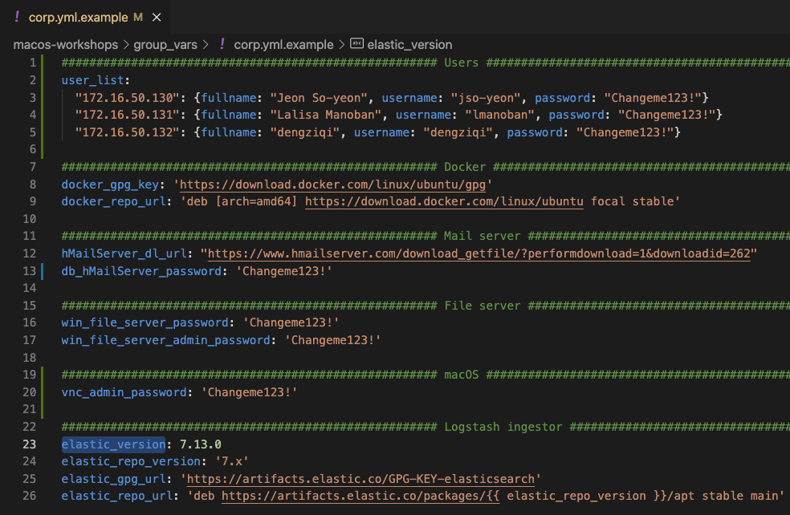

# Init Ansible playbooks

# Init Ansible playbooks
## hosts.ini
This file specify the IP address for each playbook. If you used the provided IP addresses in the Terraform playbook there is no action items. If you modified the IP addresses please open this file and set the correct IP addresses.

## group_vars/all.yml
1. `cp group_vars/all.yml.example group_vars/all.yml`
1. `vim group_vars/all.yml` and set:
  1. `internal_domain` - Local domain for the corp subnet
  1. `external_domain` - External domain to use for the EC2 instances in the public subnet
  1. <IAMGE>
  <IAMGE>
  <IAMGE>

## group_vars/corp.yml
1. `cp group_vars/corp.yml.example group_vars/corp.yml`
1. `vim group_vars/corp.yml` and set:
  1. `win_file_server_password` - Password for normal users for file server
  1. `win_file_server_admin_password` - Password for admin users for file server
  1. `db_hMailServer_password` - Password for hMaiLServer database
  1. 

## group_vars/sec_tools.yml
1. `cp group_vars/sec_tools.yml.example group_vars/sec_tools.yml`
1. `vim group_vars/sec_tools.yml` and set:
  1. Arkmie
    1. `monitoring_interface` - Interface for Arkmie to monitor
    1. `arkmie_version` - Version of Armkie to download and install
    1. `arkmie_admin_user` - Set the Arkmie admin username
    1. `arkmie_admin_password` - Set the Arkmie admin password
    1. `arkmie_regular_user` - Set the Arkmie workshop user username
    1. `arkmie_regular_password` - Set the Arkmie workshop user password
    1. `elasticsearch_oss_version` - Specify the version of Elasticsearch to install
  1. Winlogbeat
    1. `winlogbeat_version` - Version of Winlogbeat to install
<TODO>
<TODO>
<TODO>

## group_vars/windows.yml
<TODO>
<TODO>
<TODO>

## References
* 
* 
* 
* 
* 
* 
* 
* 
