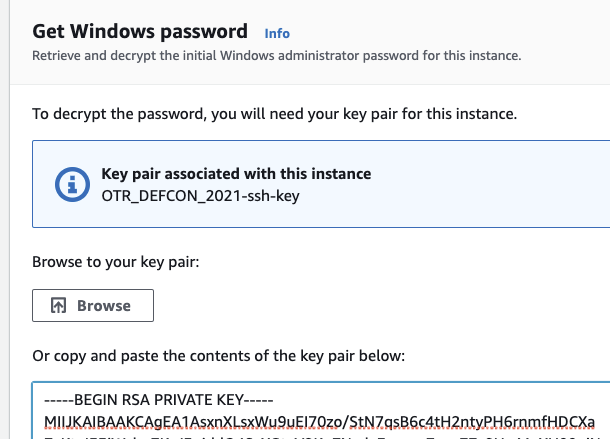
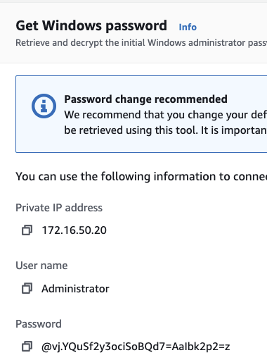

# Install/Setup corp subnet
## Wiki server
1. `cd macos-workshop`
1. `ansible-playbook -i hosts.ini deploy_wiki_server.yml -u ubuntu --key-file terraform/ssh_keys/id_rsa`
1. Open web browser to `http://172.16.50.30:80`
<TODO>
<TODO>
<TODO>

## Windows file server
### Get Administrator password
1. Login into AWS webGUI console
1. Services > Compute > EC2 
1. Select the Windows file server EC2 instance
1. Actions > Security > Get Windows Password
1. Paste the contents of `terraform/ssh_keys/id_rsa` into the text box
  1. 
1. Select "Decrypt Password"
  1. 
<TODO>
<TODO>
<TODO>

### Setup WinRM
1. Use an RDP client to connect to Windows file server
1. Open a Powershell instance as Administrator
1. `Set-ExecutionPolicy Unrestricted`
1. `powershell -NoProfile -ExecutionPolicy Bypass -Command "iex ((new-object net.webclient).DownloadString('https://raw.githubusercontent.com/ansible/ansible/devel/examples/scripts/ConfigureRemotingForAnsible.ps1'))"`
1. `exit`
<TODO>
<TODO>
<TODO>

### Setup group_vars/windows.yml
1. `vim group_vars/windows.yml` and set:
  1. `ansible_user` - `Administrator`
  1. `ansible_password` - Set this to the password obtained from the AWS console with SSH key
<TODO>
<TODO>
<TODO>

### Run Ansible playbook
1. `cd macos-workshop`
1. `ansible-playbook -i hosts.ini deploy_win_file_server.yml`
<TODO>
<TODO>
<TODO>

## References
### Wiki
* [Bitnami - Dokuwiki](https://raw.githubusercontent.com/bitnami/bitnami-docker-dokuwiki/master/docker-compose.yml)
* [Bitnami Docker Image for DokuWiki](https://hub.docker.com/r/bitnami/dokuwiki/)
* 
* 
* 
* 