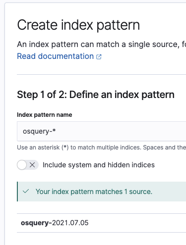

# Elastic
For the lastest installation instructions for this repo please see this blog post: [IR TALES: THE QUEST FOR THE HOLY SIEM: ELASTIC STACK + SYSMON + OSQUERY](https://holdmybeersecurity.com/2021/01/27/ir-tales-the-quest-for-the-holy-siem-elastic-stack-sysmon-osquery/)

 WARNING  
This Ansible playbook will allocate half of the systems memory to Elasticsearch. For example, if a machine has 16GBs of memory, 8GBs of memory will be allocated to Elasticsearch. 
 WARNING 

## Init Ansible playbook
1. `vim macos-workshop/ChooseYourSIEMAdventure/hosts.ini` and add the Elastic server IP address under `[elastic]`
1. `vim macos-workshop/ChooseYourSIEMAdventure/group_vars/all.yml` and set:
  1. `base_domain` – Set the domain where the server resides
  1. `timezone` – OPTIONAL – The default timezone is UTC+0
  1. `siem_username` – Ignore this setting
  1. `siem_password` – Ignore this setting
  1. 
1. `vim macos-workshop/ChooseYourSIEMAdventure/group_vars/elastic.yml` and set:
  1. `hostname` – Set the desired hostname for the server
  1. `elastic_repo_version` – Change the repo version to install the Elastic stack – best to leave as default
  1. `elastic_version` – Set the version of the Elastic stack to install
  1. 

## Run Ansible playbook
1. `ansible-playbook -i hosts.ini deploy_elastic.yml -u <username> --key-file terraform/ssh_keys/id_rsa`
  1. 

## Generate Let's Encrypt certificate
1. SSH into Elastic EC2 instance
1. `sudo su`
1. `apt install certbot python3-certbot-nginx -y`
1. `certbot --nginx -d elastic.<external domain>`
  1. Enter the e-mail for the admin of the domain
  1. Enter `A` for Terms of Service
  1. Enter `N` to share e-mail with EFF
  1. Enter `2` to redirect HTTP traffic to HTTPS 
1. Review NGINX config: `/etc/nginx/conf.d/kibana.conf` 
1. `systemctl restart nginx`

## Create workshop user
1. Open browser to `https://elastic.<external domain>` and login
  1. Enter `elastic` for username
  1. Enter `<ealstic user password generated during Ansible playbook - cat /tmp/elasticsearch-setup-passwords.txt>`
1. Settings > Management > Stack Management
1. Security > Users
1. Select "Create user" in the top-right
  1. Enter `threathunter` into username
  1. Enter `threathunter` into full name
  1. Leave e-mail blank
  1. Enter a password for the user
  1. Select `viewer` for roles
  1. 
  1. Select "Create user"

## Create index patterns
1. Open browser to `https://elastic.<external domain>` and login
  1. Enter `elastic` for username
  1. Enter `<ealstic user password generated during Ansible playbook - cat /tmp/elasticsearch-setup-passwords.txt>`
1. Settings > Management > Stack Management
1. Kibana > Index patterns
1. Select "Create index patterns" in the top-right
  1. Define an index pattern
    1. Enter `osquery-*` into index pattern name
    1. 
  1. Configure settings
    1. Select `@timestamp` for Time field
  1. Select "Create index pattern"
1. Repeat for `sysmon` and `test`

## References
* 
* 
* 
* 
* 
* 
* 
* 
* 
* 
* 
* 
* 
* 
* 