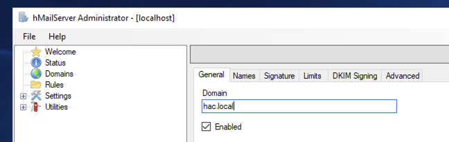
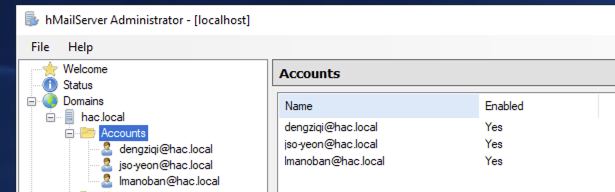
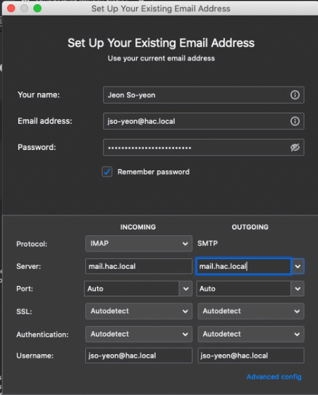

# Setup hMail server as a mail server

## Install hMaiLServer
1. [Download hMaiLServer](https://www.hmailserver.com/download_getfile/?performdownload=1&downloadid=262)
1. Install hMaiLServer
1. Select database-type
    1. Select `Use built-in database engine`
1. Enter `<mysql_hMailServer_password from group_vars/corp.yml>` for password

## Domains and accounts
1. Start hMailAdmin
1. Enter `<mysql_hMailServer_password from group_vars/corp.yml>` for password

### Create domain
1. Select "Domains" on the left
1. Select "Add" on the right
    1. Enter `hac.local` into domain
    1. 
    1. Select "Save"

### Create users
1. Domains > `<internalCorpDomain in terraform/variables.tf>`> Accounts
1. Select "Add" on the right
    1. Enter `<username>` into address
    1. Enter `<user password>` into Password
    1. Repeat for all users
    1. 
    
## Test mail server
1. Download and install Thunderbird
1. Manually add e-mail
    1. 

## Open mail relay test
1. `telnet 172.16.50.20 25`
1. `HELO <HOSTNAME>`
1. `MAIL FROM: admin@example.com`
1. `RCPT TO: lmanoban@hac.local`
1. 
```
DATA
Subject: hello world
Hello world! I am the test email.
.

QUIT
``` 


## References
* [Getting Started with hMailServer: Installation and Configuration](https://adamtheautomator.com/hmailserver/)
* [64bit MySQL requires 32bit libmysql.dll](https://www.hmailserver.com/forum/viewtopic.php?t=26759)
* [ERROR 1396 (HY000): Operation CREATE USER failed for 'jack'@'localhost'](https://stackoverflow.com/questions/5555328/error-1396-hy000-operation-create-user-failed-for-jacklocalhost)
* [HOW DO I CREATE A NEW DATABASE AND DATABASE USER IN MYSQL?](https://matomo.org/faq/how-to-install/faq_23484/)
* [Securing the Initial MySQL Accounts](http://download.nust.na/pub6/mysql/doc/refman/5.1/en/default-privileges.html#:~:text=On%20Windows%2C%20if%20you%20want,so%20removing%20it%20improves%20security.)
* [What is the default username and password in MySQL?](https://tableplus.com/blog/2018/11/what-is-the-default-username-password-in-mysql.html#:~:text=In%20MySQL%2C%20by%20default%2C%20the,skip%2Dgrant%2Dtables%20option.)
* [Installation tutorial](https://www.hmailserver.com/documentation/v5.4/?page=howto_install)
* [How To Manually Send Email Using Telnet to Check for Open Relays](https://blog.infusiontechsolutions.com/how-to-manually-send-email-using-telnet-to-check-for-open-relays/)
* [How to Create a Guest Account on the Latest Version of Windows 10](https://lifehacker.com/how-to-create-a-guest-account-on-the-latest-version-of-1765447417)
* [New-SmbShare](https://docs.microsoft.com/en-us/powershell/module/smbshare/new-smbshare?view=windowsserver2019-ps)
* [4 Ways to Enable and Disable Built-in Guest on Windows 10](https://www.isunshare.com/windows-10/4-ways-to-enable-and-disable-built-in-guest-on-windows-10.html)
* [Why doesn't Windows 10 ask me for my credentials when connecting to my network share?](https://support.morrodata.com/support/solutions/articles/14000088834-why-doesn-t-windows-10-ask-me-for-my-credentials-when-connecting-to-my-network-share-)
* []()
* []()
* []()
* []()
