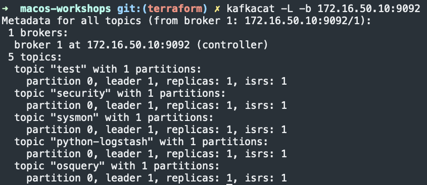
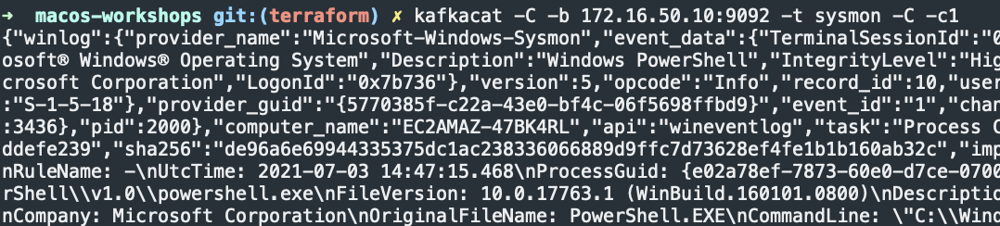

# Logstash ingestor

## Init Ansible playbook
1. `vim hosts.ini` and add the Logstash ingestor server IP address under `[logstash_ingestor]`
    1. Make sure `[splunk]`, `[graylog]` and `[splunk]` are defined as well
1. `vim group_vars/corp.yml` and set:
    1. `elastic_repo_version` – Change the repo version to install the Elastic stack – best to leave as default
    1. `elastic_version` – Set the version of the Elastic stack to install

## Run Ansible playbook
1. `cd macos-workshop`
1. `ansible-playbook -i hosts.ini deploy_logstash_ingestor.yml -u ubuntu --key-file terraform/ssh_keys/id_rsa`

## Test SIEMs and logstash ingestor
1. `pip3 install --user pylogbeat==2.0.0`
1. `ipython`
```python
from datetime import datetime, date, timezone
from pylogbeat import PyLogBeatClient
import string
import random

"""
Send randomly generated message
"""
# Generate test log event
message = {
    "@timestamp": datetime.utcnow().replace(tzinfo=timezone.utc).isoformat(),
    "@version": "1",
    "host": "my-local-host",
    "level": "INFO",
    "logsource": "my-local-host",
    "blah": {
        "foo": "bar"
    },
    "pid": 65534,
    "program": "example.py",
    "event": {
        "module": "test"
    }
}

# Create connector
client = PyLogBeatClient("172.16.50.10", 5044, ssl_enable=True, ssl_verify=False)

# Connect to server, send log message, and close connection
client.connect()
client.send([message])
client.close()
print (f"[+] - {datetime.now()} - Sucessfully sent random message to {siem.platform} - {siem.host}:{siem.port}") 
  
```

<TODO>
<TODO>
<TODO>
<TODO>
<TODO>

## Deleting Kafka topics
1. SSH into Kafka server
1. `kafka-topics --zookeeper localhost:2181 --list`
1. `kafka-topics --zookeeper localhost:2181 --delete --topic <topic name>`

## Get a list of Kafka topics
1. `kafkacat -L -b 172.16.50.10:9092`
    1. 

## Retrieve data from topic
1. `kafkacat -C -b 172.16.50.10:9092 -t sysmon -C -c1`
    1. 
1. `kafkacat -C -b 172.16.50.10:9092 -t python-logstash`
    <TODO>


## Debugging
If your logs aren't making it to Kafka check `/tmp/unknown-topic.log`. This is a debug file to catch all logs that don't get ingested by Kafka.

## References
### Kafka
* [Learn how to use Kafkacat – the most versatile Kafka CLI client](https://dev.to/de_maric/learn-how-to-use-kafkacat-the-most-versatile-kafka-cli-client-1kb4)
* [Kafka input to logstash plugin](https://stackoverflow.com/questions/42813032/kafka-input-to-logstash-plugin)
* [The Power of Kafka Partitions: How to Get the Most out of Your Kafka Cluster](https://www.instaclustr.com/the-power-of-kafka-partitions-how-to-get-the-most-out-of-your-kafka-cluster/#:~:text=Partitions%20are%20the%20main%20concurrency,consumer%20loads%20to%20be%20scaled.&text=The%20consumers%20are%20shared%20evenly,increasing%20both%20consumers%20and%20partitions.)
* [Can multiple Kafka consumers read same message from the partition](https://stackoverflow.com/questions/35561110/can-multiple-kafka-consumers-read-same-message-from-the-partition)
* [Logstash - Kafka input plugin](https://www.elastic.co/guide/en/logstash/current/plugins-inputs-kafka.html#plugins-inputs-kafka-group_id)
* [Manual Install using Systemd on Ubuntu and Debian](https://docs.confluent.io/platform/current/installation/installing_cp/deb-ubuntu.html)
* [How to Install Apache Kafka on Ubuntu 20.04](https://tecadmin.net/how-to-install-apache-kafka-on-ubuntu-20-04/)
* []()
* []()