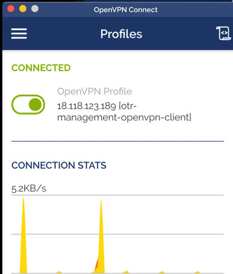
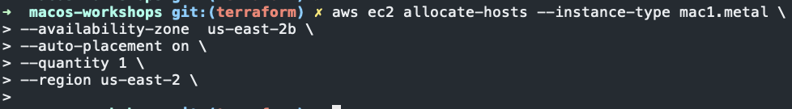
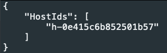
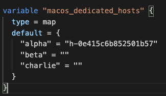
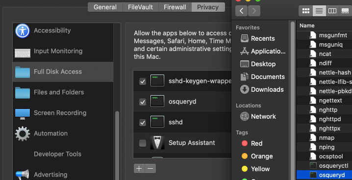
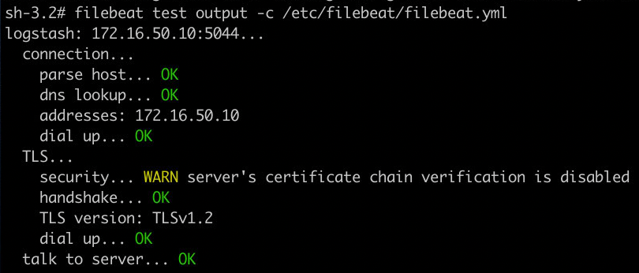

# macOS clients

## Local testing
TO test this deployment on a local VM and ingest logs into the SIEMS you `NEED` to ensure that host machine is connected to jumpbox/VM. If you jsut want to test the logging locally then you can skip setting up the VPN.

1. Copy OpenVPN to VM
1. `brew install openvpn-connect`
1. Open OpenVPN connect app
1. Import OpenVPN config
1. Enter OpenVPN client password from Google sheet
    1. 
1. Run Ansible playbook

## Creating dedicated hosts
1. `aws ec2 allocate-hosts --instance-type mac1.metal --availability-zone <availabilityZone - terraform/variables.tf> --auto-placement on --quantity 3 --region <availabilityZone - terraform/variables.tf - leave AZ off>`
    1. 
    1. 
    1. Copy the host ID and press `q`
1. `vim terraform/variables.tf` scroll down to `macos_dedicated_hosts` section
    1. Enter the host ID for one openings
    1. 

## Init playbook
1. `git clone git@github.com:OTRF/macos-workshop`
1. `cd macos-workshop`
1. `vim host.ini` and append the macOS IP address under `[macos_clients]`

## Run playbook
1. `ansible-playbook -i hosts.ini deploy_macos_clients.yml -u threathunter -K`
    1. Enter password
    
## Grant OsqueryD full disk access
1. Open Finder
1. Select "GO" at the top then "Go to Folder..."
    1. Enter `/usr/local/bin`
    1. Find `osqueryd` binary 
1. Open System preference panel
1. Security & privacy > Prinvacy > Full Disk Access 
    1. Drag and drop `osqueryd` binary from Finder to  System preference panel
    1. 
1. `launchctl unload /Library/LaunchDaemons/com.facebook.osqueryd.plist`
    1. Stop Osqueryd service
1. `launchctl load /Library/LaunchDaemons/com.facebook.osqueryd.plist`
    1. Start Osqueryd service

## Test Osquery and Filebeat
1. `filebeat test output -c /etc/filebeat/filebeat.yml`
    1. Test Filebeat + Logstash + OpenVPN connection
    1. 
1. `kafkacat -C -b 172.16.50.10:9092 -t osquery -C`

## Password reset
1. SSH into machine as `ec2-user`
1. `sudo su`
1. `sudo /usr/bin/dscl . -passwd /Users/<username> <password>`
1. `sudo rm -r /Users/<username>/Library/Keychains/*`

## References
### Filebeat
* [Avoid Ansible command warning](https://ansibledaily.com/avoid-ansible-command-warnings/)
* 
* [Create target directory when extracting tarball]()
* [Mac OS/X won't let me mkdir /usr/share/tomcat6, even as root](https://apple.stackexchange.com/questions/301976/mac-os-x-wont-let-me-mkdir-usr-share-tomcat6-even-as-root)
* [Deploying Filebeat on MacOS X](https://discuss.elastic.co/t/deploying-filebeat-on-macos-x/37785/11)
* [Filebeat quick start: installation and configuration](https://www.elastic.co/guide/en/beats/filebeat/7.13/filebeat-installation-configuration.html)
* [Directory layout](https://www.elastic.co/guide/en/beats/filebeat/current/directory-layout.html#_default_paths)
* [community.general.launchd – Manage macOS services](https://docs.ansible.com/ansible/latest/collections/community/general/launchd_module.html)
* [IMPLEMENTING LOGSTASH AND FILEBEAT WITH MUTUAL TLS (MTLS)](https://holdmybeersecurity.com/2021/03/31/implementing-logstash-and-filebeat-with-mutual-tls-mtls/)
* [Filebeat - test command](https://www.elastic.co/guide/en/beats/filebeat/current/command-line-options.html)
* 
* 
* 
* 
* 
* 
* 

### Osquery
* [Github - palantir/osquery-configuration](https://github.com/palantir/osquery-configuration)
* [OPERATION CLEANUP: ERADICATING MALWARE WITH OSQUERY AND KOLIDE](https://holdmybeersecurity.com/2020/03/01/operation-cleanup-eradicating-malware-with-osquery-and-kolide/)
* [Installing .pkg with terminal ?](https://apple.stackexchange.com/questions/72226/installing-pkg-with-terminal)
* [Auditing with osquery: Part Two — Configuration and Implementation](https://blog.palantir.com/auditing-with-osquery-part-two-configuration-and-implementation-87a8bba0ef48)
* [community.general.launchd – Manage macOS services](https://docs.ansible.com/ansible/latest/collections/community/general/launchd_module.html)
* [osquery-configuration/Classic/Endpoints/MacOS/osquery_no_tls.flags](https://github.com/palantir/osquery-configuration/blob/master/Classic/Endpoints/MacOS/osquery_no_tls.flags)
* [Installing on macOS](https://osquery.readthedocs.io/en/stable/installation/install-macos/)
* [Deploying Osquery Part 2 - The basics, cont.](https://blog.securelyinsecure.com/post/deploying-osquery-pt2/)
* [osquery-configuration/Classic/Servers/Linux/osquery.flags](https://github.com/palantir/osquery-configuration/blob/master/Classic/Servers/Linux/osquery.flags)
* 
* 

