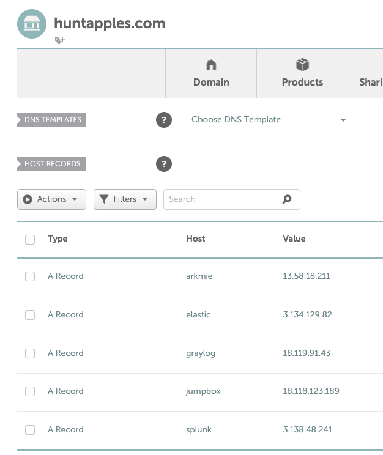

# Install/Setup Management subnet

## Check termination protection on jumpbox
1. Services > Compute > EC2 > Instances > Instances
1. Check `${VPC_NAME}_jump_box` 
1. Actions > Instance settings > Change termination protection
  1. Ensure that termination protection is enabled

## Setup jumpbox/VPN
The Terraform playbook above will execute the following script `files/setup_openvpn.sh` to setup an OpenVPN server on the jumpbox.

1. `cat ~/.ssh/id_rsa.pub` and copy output
1. `ssh -i ssh_keys/id_rsa ubuntu@<jumpbox public IPv4>`
1. `echo '<YOUR SSH pub key>' >> ~/.ssh/authorized_keys`
1. `sudo su`
1. `apt update -y && apt upgrade -y && reboot`
1. Login into jumpbox using `YOUR` SSH key
1. Ensure that `client.ovpn` exists in the home directory
1. `sudo su`
1. Add VPC subnets to OpenVPN server config
  1. `echo 'push "route 172.16.21.0 255.255.255.0"' >> /etc/openvpn/server.conf`
    1. Management subnet
  1. `echo 'push "route 172.16.43.0 255.255.255.0"' >> /etc/openvpn/server.conf`
    1. Public subnet
  1. `echo 'push "route 172.16.50.0 255.255.255.0"' >> /etc/openvpn/server.conf`
    1. Corp subnet
  1. `echo 'pull-filter ignore redirect-gateway' >> client.ovpn`
    1. Tell client to ignore sending all traffic to OpenVPN server
1. `systemctl restart openvpn@server.service`
1. `exit`
1. `scp ubuntu@<jumpbox public IPv4>:/home/ubuntu/client.ovpn ~/Desktop/client.ovpn`
  1. Download OpenVPN client config
1. Import the OpenVPN client config into your VPN client

# Setup public DNS records
For this workshop we acquired several doamins but the domain to be used by workshop participants is `huntapples.com`. This public domain will be used to generate Let's Encrypt HTTP certificates for Splunk, Elastic, Graylog, and Arkmie.

## References
### OpenVPN
* [Expanding the scope of the VPN to include additional machines on either the client or server subnet.](https://openvpn.net/community-resources/expanding-the-scope-of-the-vpn-to-include-additional-machines-on-either-the-client-or-server-subnet/)
* [How to Download a File from a Server with SSH / SCP](https://osxdaily.com/2016/11/07/download-file-from-server-scp-ssh/)
* 
* 
* 
* 
* 
* 
