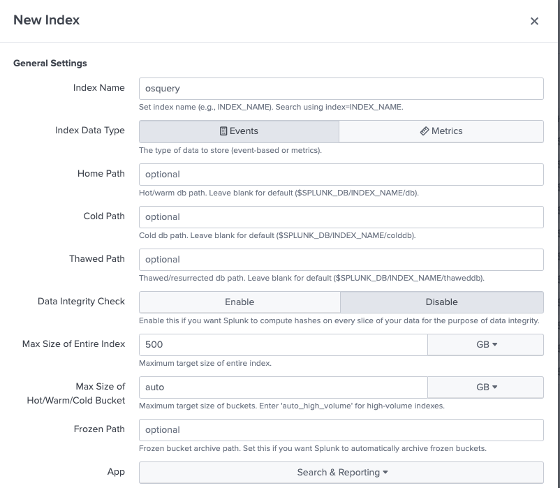
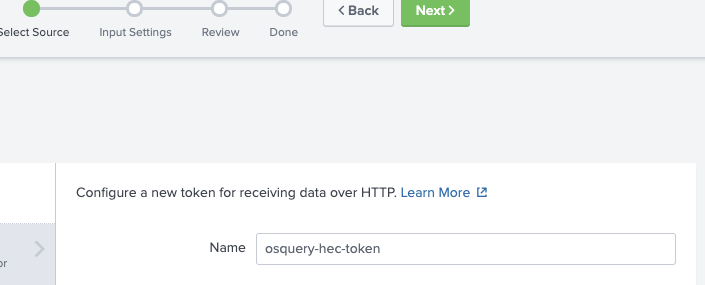
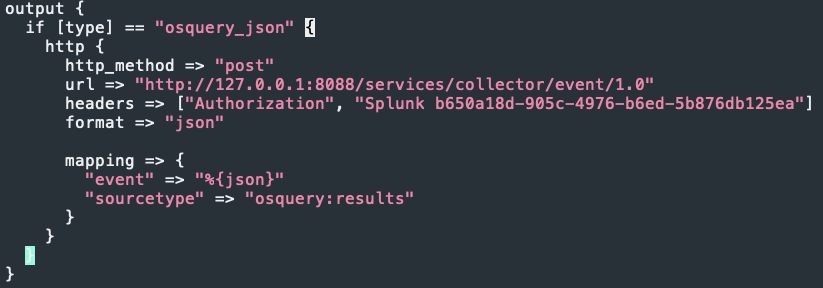

# Splunk
For the lastest installation instructions for this repo please see this blog post: [IR TALES: THE QUEST FOR THE HOLY SIEM: SPLUNK + SYSMON + OSQUERY + ZEEK](https://holdmybeersecurity.com/2021/04/07/ir-tales-the-quest-for-the-holy-siem-splunk-sysmon-osquery-zeek/)

## Init Ansible playbook
1. `vim macos-workshop/ChooseYourSIEMAdventure/hosts.ini` and add the Graylog server IP address under `[splunk]`
1. `vim macos-workshop/ChooseYourSIEMAdventure/group_vars/all.yml` and set:
    1. `base_domain` – `<external_domain - group_vars/all.yml>`
    1. `timezone` – OPTIONAL – The default timezone is UTC+0
    1. `siem_username` – Ignore this setting
    1. `siem_password` – Set the Splunk admin password
    1. 
1. `vim macos-workshop/ChooseYourSIEMAdventure/group_vars/splunk.yml` and set:
    1. `hostname` – Set the desired hostname for the server
    1. `splunk_version` – Set the desired version of Splunk to use
    1. `splunk_dl_url` – Set to the URL to download Splunk
    1. `beats_port` – OPTIONAL – Set the port to ingest logs using BEATs clients
    1. `elastic_version` – OPTIONAL – Set the desired version of Logstash to use with Splunk – best to leave as default
        1. `elastic_repo_version` – Change the repo version to install Logstash
    1. 

## Run Ansible playbook
1. `ansible-playbook -i hosts.ini deploy_splunk.yml -u ubuntu --key-file terraform/ssh_keys/id_rsa`
    1. 

## Generate Let's Encrypt certificate
1. SSH into Elastic EC2 instance
1. `sudo su`
1. `apt install certbot python3-certbot-nginx -y`
1. `certbot --nginx -d splunk.<external domain>`
  1. Enter the e-mail for the admin of the domain
  1. Enter `A` for Terms of Service
  1. Enter `N` to share e-mail with EFF
  1. Enter `2` to redirect HTTP traffic to HTTPS 
1. Review NGINX config: `/etc/nginx/conf.d/graylog.conf` 
1. `systemctl restart nginx`

## Create workshop user
1. Open browser to `https://splunk.<external domain>` and login
  1. Enter `admin` for username
  1. Enter `<siem_password>` into Password
1. Settings > Users and Authentication > Users
1. Select "New User" in top right
  1. Enter `threathunter` into name
  1. Enter `threathunter` into full name
  1. Leave e-mail blank
  1. Enter a password for the user
  1. UNcheck `Require password change on first login`
  1. 
  1. Select "Create user"

## Create indexes
1. Settings > Data > Indexes
1. Select "New index" in the top right
  1. Enter `osquery` into Index name
  1. Select `Events` for Index Data Type
  1. Ensure "Search & Reporting" is selected for App
  1. 
  1. Select "Save"
1. Repeat for the test index

## Install Osquery Splunk TA
1. Apps > Find More Apps
1. Search for `osquery`
1. Select "Install" for [add-on for Osquery](https://apps.splunk.com/app/4402)
  1. Enter Splunk account credentials
  1. Install app
1. Restart Splunk

## Install Sysmon Splunk TA
1. Apps > Find More Apps
1. Search for `Sysmon`
1. Select "Install" for [Splunk Add-On for Microsoft Sysmon](https://apps.splunk.com/app/1914)
  1. Enter Splunk account credentials
  1. Install app
1. Restart Splunk

## Create HEC tokens
1. Settings > Data > Data inputs
1. Type > HTTP Event Collector
1. Select "New Token" in the top right
1. Select Source
  1. Enter `osquery-hec-token` into Name
  1. 
  1. Select "Next"
1. Input Settings
  1. Select `osquery:results` for sourcetype
  1. Select `osquery` for allowed indexes-
  1. 
  1. Select "Next"
1. Review
  1. Select "Next"
1. Done
1. Repeat for test index
1. Settings > Data > Data inputs
1. Type > HTTP Event Collector
1. Copy HEC tokens

## Setup Logstash with HEC tokens
1. SSH into Splunk EC2 instance
1. `sudo su`
1. `systemctl stop logstash`
1. `rm /etc/logstash/conf.d/3*-output-*.conf`
  1. Delete all the outputs
1. `curl https://raw.githubusercontent.com/OTRF/macos-workshops/main/conf/splunk/30-output-logstash-service.conf?token=AIRH4CATUWWQ5SJO44XIHGLA3UJTU --output 30-output-splunk-osquery.conf`
1. `sed -i "s#{{ logstash_type }}#osquery_json#g" 30-output-splunk-osquery.conf`
  1. Set Logstash type
1. `sed -i "s#{{ hec_token }}#<osquery-hec-token>#g" 30-output-splunk-osquery.conf`
  1. Set Splunk HEC token
1. `sed -i "s#{{ splunk_source_type }}#osquery:results#g" 30-output-splunk-osquery.conf`
  1. Set Splunk source type
1. 

## DEBUGGING Logstash
* `tail -f /var/log/logstash/logstash-plain`

## References
* [How to Set up Splunk HEC the Smart Way](https://hurricanelabs.com/splunk-tutorials/how-to-set-up-splunk-hec-the-smart-way/)
* [What is the reseasoning behind the Sysmon sourcetype?](https://community.splunk.com/t5/Archive/What-is-the-reseasoning-behind-the-Sysmon-sourcetype/m-p/427987)
* [How to create HEC token through an API call?](https://community.splunk.com/t5/Dashboards-Visualizations/How-to-create-HEC-token-through-an-API-call/m-p/409115)
* [Using the AUTH LOGIN sessionkey with Curl SplunkAPI](https://community.splunk.com/t5/Archive/Using-the-AUTH-LOGIN-sessionkey-with-Curl-SplunkAPI/m-p/47628)
* [Using Ansible uri module to add users to splunk via REST API](https://community.splunk.com/t5/Getting-Data-In/Using-Ansible-uri-module-to-add-users-to-splunk-via-REST-API/m-p/343351)
* [Splunk REST API Reference Manual](https://docs.splunk.com/Documentation/Splunk/8.2.1/RESTREF/RESTintrospect)
* 
* 
* 
* 
* 
* 

