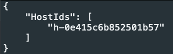
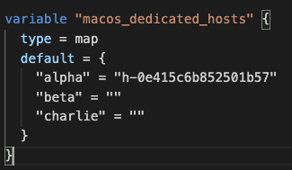

# Terraform

## AWS inital setup
### Create an AWS account
Follow the steps on this [page to create an AWS account](https://aws.amazon.com/premiumsupport/knowledge-center/create-and-activate-aws-account/)

### Select a region anda avability zone
Once you login into AWS it should automatically select the nearest datacenter based on your IP address. This repo has been created and tested on the `US East - Ohio` datacenter and avablility zone `B`. This repo should be compatible with any region and avability zone but pick the best region based on your location/users. As a side note, dedicated hosts to run macOS only exist in certain regions and avability zones which is why we selected `Ohio` for the region and `B` for the avability zone.

## Install/Setup AWS CLI and Terraform on macOS
* [AWS CLI Windows install](https://docs.aws.amazon.com/cli/latest/userguide/install-cliv2-windows.html)
* [AWS CLI Linux install](https://docs.aws.amazon.com/cli/latest/userguide/install-cliv2-linux.html)
* [AWS CLI macOS install](https://docs.aws.amazon.com/cli/latest/userguide/install-cliv2-mac.html)

### Generate AWS access keys
1. Select `<YOUR username>` in the top-right then "My Security Credentials"
1. Scroll down to "Access keys for CLI..."
1. Select "Create access key"
  1. Save your generated access key ID and secret access key in a safe location

### Install/Setup AWS CLI with AWS access keys
1. Open terminal
1. `curl "https://awscli.amazonaws.com/AWSCLIV2.pkg" -o /tmp/AWSCLIV2.pkg`
  1. Download AWS CLI v2
1. `sudo installer -pkg /tmp/AWSCLIV2.pkg -target /`
  1. Install AWS CLI v2
1. `aws configure`
  1. Paste the access key ID generated from above
  1. Paste the access key generated from above
  1. Enter your region - Ohio is `us-east-2`
  1. Leave ouput format as default
  1. 
1. Credentails are saved at `~/.aws/credentials`

## Install/Setup Terraform
### Install Terraform on macOS
It should be noted that this repo only supports Terraform v0.15 and greater.

* [Terraform install on Windows](https://learn.hashicorp.com/tutorials/terraform/install-cli)
* [Terraform install on Linux ](https://learn.hashicorp.com/tutorials/terraform/install-cli)
* [Terraform install on macOS](https://learn.hashicorp.com/tutorials/terraform/install-cli)

1. `brew tap hashicorp/tap`
1. `brew install hashicorp/tap/terraform`

# Spin up Terraform environment
## Generate SSH key pair
You might be curious why you need to generate SSH keys rather than using a pre-existing key pair. The reason I create a SSH key is because when you create a Winodws machine on AWS the only way to get the password is provide your SSH PRIVATE KEY. Personally, I am not a huge fan of providing this to AWS so I prefer to generate a key pair that I can burn after the worskhop. Additionally, you can share this SSH key pair with your team for the duration of the workshop.

1. `git clone https://github.com/OTRF/macos-workshops`
1. `cd macos-workshops/terraform`
1. `ssh-keygen -b 4096 -t rsa -m pem -f ssh_keys/id_rsa -q -N ""`

## Setup variables.tf
1. `vim variables.tf` and set:
  1. `VPC_NAME` - Set this to a generic name like `OTR_DEFCON_2021`. It's important to note that all resouces created will be prepended with this variable. For example, the EC2 name for the Elastic box will be `OTR_DEFCON_2021_jump_box`.
  1. `vpcCIDRblock` - This defines the network subnet for the VPC. The subnet should be a Class B because Class C subnets will be created inside the VPC. - Default is `172.16.0.0/16`
    1. `managementCIDRblock` - This subnet hosts the VPN/jumpbox and the red team boxes. Set this value to a class C subnet inside the subnet defined above - default `172.16.21.0/24`.
    1. `publicCIDRblock` - This subnet hosts the boxes that will be interacted by workshop participants so the SIEM boxes - default `172.16.43.0/16`
    1. `corpCIDRblock` - This subnet hosts the boxes that will emulate an enterprise environment - default `172.16.50.0/16`
  1. `availabilityZone` - The AWS region to create resources in. Be default this is set to Ohio: `us-east-2b`. 
  1. `ubunut-ami` - Set this to the AMI UID 
    1. AWS Services > Compute > EC2 > Images > AMIs
    1. Search for `Ubuntu 20.04`
    1. Copy the AMI ID
  1. `windows-ami` - Set this to the AMI UID 
    1. AWS Services > Compute > EC2 > Images > AMIs
    1. Search for `windows 2019`
    1. Copy the AMI ID
  1. `macos-ami` - Set this to the AMI UID 
    1. AWS Services > Compute > EC2 > Images > AMIs
    1. Search for `macOS catalina`
    1. Copy the AMI ID
  1. Repeat the same steps for the Ubuntu AMI for the Windows server AMI
  1. `siem_servers_map` - This maps SIEM names to IP addresses for the local subnet. It's best to leave this set as default.
  1. `management_subnet_map` - Same as the map above
  1. `corp_servers_map` - Same as the maps above

## Creating dedicated hosts
1. `aws ec2 allocate-hosts --instance-type mac1.metal --availability-zone <availabilityZone - terraform/variables.tf> --auto-placement on --quantity 3 --region <availabilityZone - terraform/variables.tf - leave AZ off>`
    1. 
    1. 
    1. Copy the host ID and press `q`
1. `vim terraform/variables.tf` scroll down to `macos_dedicated_hosts` section
    1. Enter the host ID for one openings
    1. 

## Spin up Terraform environment
1. `terraform init`
1. `terraform plan`
1. `terraform apply`

## References
### Terraform
* [Install Terraform](https://learn.hashicorp.com/tutorials/terraform/install-cli)
* [Resource: aws_eip](https://registry.terraform.io/providers/hashicorp/aws/latest/docs/resources/eip)
* [Resource: aws_nat_gateway](https://registry.terraform.io/providers/hashicorp/aws/latest/docs/resources/nat_gateway)
* [How to use Terraform variables](https://upcloud.com/community/tutorials/terraform-variables/)
* [Github - angristan/openvpn-install](https://github.com/angristan/openvpn-install)
* [aws_eip_association](https://registry.terraform.io/providers/hashicorp/aws/latest/docs/resources/eip_association)
* [aws_ec2_traffic_mirror_filter_rule](https://registry.terraform.io/providers/hashicorp/aws/latest/docs/resources/ec2_traffic_mirror_filter_rule)
* [aws_network_interface](https://registry.terraform.io/providers/hashicorp/aws/latest/docs/resources/network_interface)
* [aws_route53_record](https://registry.terraform.io/providers/hashicorp/aws/latest/docs/resources/route53_record)
* [Private hosted zones](https://docs.aws.amazon.com/vpc/latest/userguide/vpc-dns.html)
* 
* 
* 
* 
* 

### AWS
* [How do I create and activate a new AWS account?](https://aws.amazon.com/premiumsupport/knowledge-center/create-and-activate-aws-account/)
* [Elastic IP addresses](https://docs.aws.amazon.com/vpc/latest/userguide/vpc-eips.html)
* [AWS CLI Windows install](https://docs.aws.amazon.com/cli/latest/userguide/install-cliv2-windows.html)
* [AWS CLI Linux install](https://docs.aws.amazon.com/cli/latest/userguide/install-cliv2-linux.html)
* [AWS CLI macOS install](https://docs.aws.amazon.com/cli/latest/userguide/install-cliv2-mac.html)
* [Quick configuration with aws configure](https://docs.aws.amazon.com/cli/latest/userguide/cli-configure-quickstart.html)
* [Using Terraform to Manage DNS Records](https://medium.com/@maxbeatty/using-terraform-to-manage-dns-records-b338f42b50dc)
* [What is a DNS MX record?](https://www.cloudflare.com/learning/dns/dns-records/dns-mx-record/)
* 
* 
* 
* 